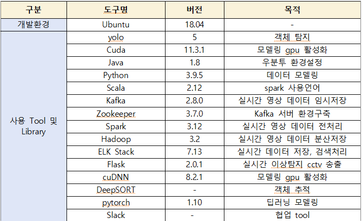
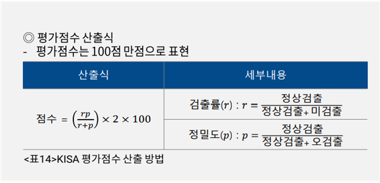
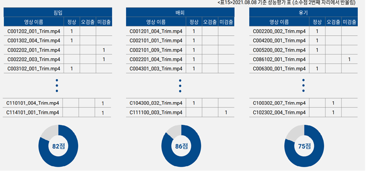
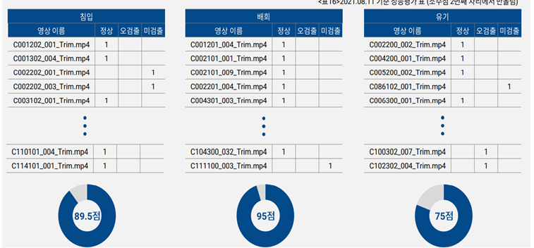
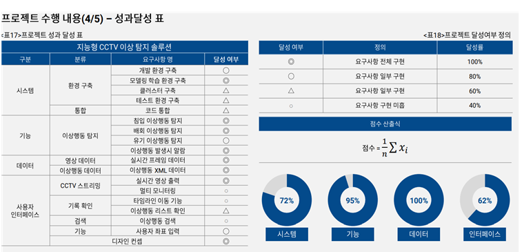
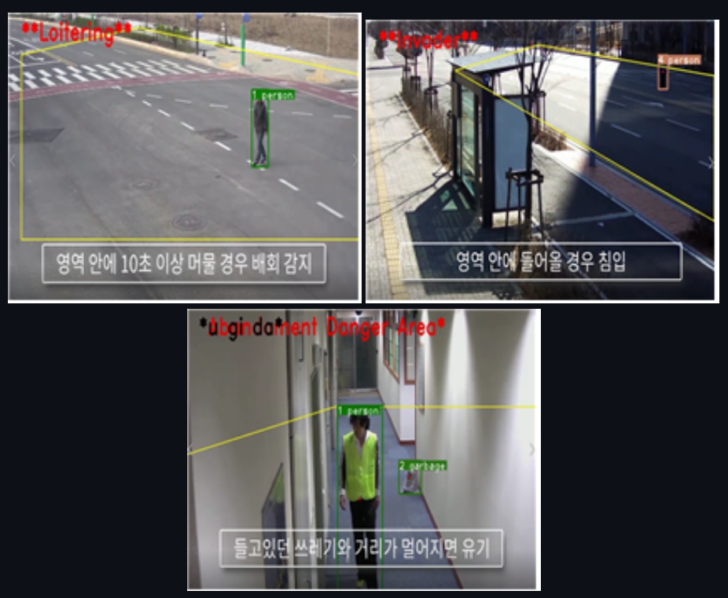

 # 지능형 이상탐지 CCTV 솔루션 grk
 
 ### 기간  
 2021.6.3~2021.8.17  
 
 ### 내용   
 CCTV 영상의 이상행동(침입,배회,유기) 탐지에 대해 실시간 알람의 데이터플랫폼 구성, 딥러닝을 통해 객체를 탐지하고 추적하여, 이상행동 탐지시 알람을 띄워주는 솔루션 개발  
 
 ### 상세 과정
 1. Pyspark+OpenCV로 실시간 화면(노트북) 인식 및 프레임 단위로 쪼갠 후 kafka에 저장(buffer)
 2. kafka 프레임 데이터 Yolov5 모델링
 3. 모델링 데이터 pandas로 dataframe화 시킨 후 HDFS에 분산 저장
 4. HDFS 적재 데이터 pyspark+OpenCV로 역직렬화(디코딩)
 5. 디코딩 된 데이터 flask로 출력
 
 ### 사용 기술 stack
 
 

### System Architecture  

     

## 인원 및 역할  
  - 총원 6명 
  - 역할 : 딥러닝 모델링 , 웹 서비스 구현
## 상세 역할
  
  **< part (1) : 딥러닝 모델링 >**  
   - Yolov5(객체탐지), OpenCV(객체확인 및 이상행동 알림), DeepSORT(객체추적)와 팀내에서 고안한 gg알고리즘을 활용해 이상행동(배회,침입,유기)중 유기 판별 알고리즘 구현  
   
  **< part (2) : 웹 서비스 구현 >**   
   - 이상행동 탐지 모델링 code를 flask와 연동해 실시간 이상탐지 스트리밍 웹 페이지 구현  

## 프로젝트 결과

  
**KISA 평가점수 산출 방법**  
  
**1차 성능평가 지표 점수**  
  
**2차 성능평가 지표 점수**  
  
**성과 달성표**  
  
**시연 결과**  

